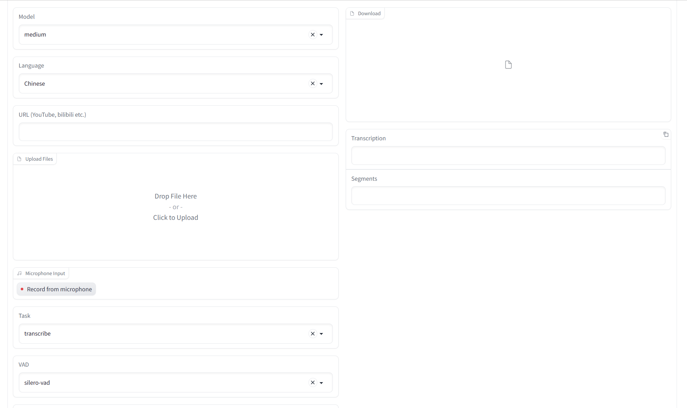
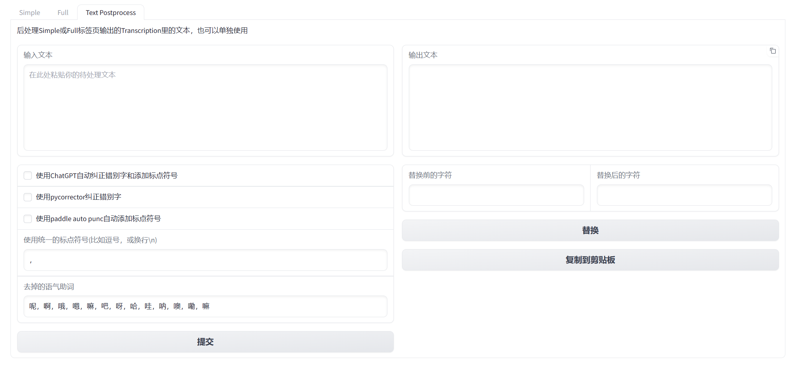

Check out the configuration reference at https://huggingface.co/docs/hub/spaces-config-reference

Fork from : https://huggingface.co/spaces/aadnk/faster-whisper-webui/tree/main

# 简介

这个Gradio App的主要作用是把哔哩哔哩或youtube等网站的视频的音频或其他来源的音频转录成文本，并对文本进行一些后处理。

我二次开发这个App的初衷是用来给无字幕的视频做笔记。

转录界面：


我主要添加了一个文本后处理的tab：
  
* 支持使用ChatGPT或Paddle auto punc（二选一）对文本自动添加合适的标点符号
* 支持使用pycorrector对文本进行纠错
* 支持去掉指定的语气助词
* 支持对输出文本的指定字符进行替换

该Gradio App同时部署在：

* HuggingFace Spaces: https://huggingface.co/spaces/wwdok/faster-whisper-webui-cn
* OpenXLab: https://openxlab.org.cn/apps/detail/wwdok/faster-whisper-webui-cn
* ~~ModelScope: https://modelscope.cn/studios/wwd123/faster-whisper-webui-cn~~

# Running Locally

To run this program locally, first install Python 3.9+ and Git. Then install Pytorch 10.1+ and all the other dependencies:
```
pip install -r requirements.txt
```

You can find detailed instructions for how to install this on Windows 10/11 [here (PDF)](docs/windows/install_win10_win11.pdf).

Finally, run the full version (no audio length restrictions) of the app with parallel CPU/GPU enabled:
```
python app.py --input_audio_max_duration -1 --server_name 127.0.0.1 --auto_parallel True
```

You can also run the CLI interface, which is similar to Whisper's own CLI but also supports the following additional arguments:
```
python cli.py \
[--vad {none,silero-vad,silero-vad-skip-gaps,silero-vad-expand-into-gaps,periodic-vad}] \
[--vad_merge_window VAD_MERGE_WINDOW] \
[--vad_max_merge_size VAD_MAX_MERGE_SIZE] \
[--vad_padding VAD_PADDING] \
[--vad_prompt_window VAD_PROMPT_WINDOW]
[--vad_cpu_cores NUMBER_OF_CORES]
[--vad_parallel_devices COMMA_DELIMITED_DEVICES]
[--auto_parallel BOOLEAN]
```
In addition, you may also use URL's in addition to file paths as input.
```
python cli.py --model large --vad silero-vad --language Japanese "https://www.youtube.com/watch?v=4cICErqqRSM"
```

Rather than supplying arguments to `app.py` or `cli.py`, you can also use the configuration file [config.json5](config.json5). See that file for more information. 
If you want to use a different configuration file, you can use the `WHISPER_WEBUI_CONFIG` environment variable to specify the path to another file.

### Multiple Files

You can upload multiple files either through the "Upload files" option, or as a playlist on YouTube. 
Each audio file will then be processed in turn, and the resulting SRT/VTT/Transcript will be made available in the "Download" section. 
When more than one file is processed, the UI will also generate a "All_Output" zip file containing all the text output files.

## Diarization

To detect different speakers in the audio, you can use the [whisper-diarization](https://gitlab.com/aadnk/whisper-diarization) application. 

Download the JSON file after running Whisper on an audio file, and then run app.py in the 
whisper-diarization repository with the audio file and the JSON file as arguments.

## Whisper Implementation

You can choose between using `whisper` or `faster-whisper`. [Faster Whisper](https://github.com/guillaumekln/faster-whisper) as a drop-in replacement for the 
default Whisper which achieves up to a 4x speedup and 2x reduction in memory usage. 

You can install the requirements for a specific Whisper implementation in `requirements-fasterWhisper.txt` 
or `requirements-whisper.txt`:
```
pip install -r requirements-fasterWhisper.txt
```
And then run the App or the CLI with the `--whisper_implementation faster-whisper` flag:
```
python app.py --whisper_implementation faster-whisper --input_audio_max_duration -1 --server_name 127.0.0.1 --auto_parallel True
```
You can also select the whisper implementation in `config.json5`:
```json5
{
    "whisper_implementation": "faster-whisper"
}
```
### GPU Acceleration

In order to use GPU acceleration with Faster Whisper, both CUDA 11.2 and cuDNN 8 must be installed. You may want to install it in a virtual environment like Anaconda.

## Google Colab

You can also run this Web UI directly on [Google Colab](https://colab.research.google.com/drive/1qeTSvi7Bt_5RMm88ipW4fkcsMOKlDDss?usp=sharing), if you haven't got a GPU powerful enough to run the larger models.

See the [colab documentation](docs/colab.md) for more information.

## Parallel Execution

You can also run both the Web-UI or the CLI on multiple GPUs in parallel, using the `vad_parallel_devices` option. This takes a comma-delimited list of 
device IDs (0, 1, etc.) that Whisper should be distributed to and run on concurrently:
```
python cli.py --model large --vad silero-vad --language Japanese \
--vad_parallel_devices 0,1 "https://www.youtube.com/watch?v=4cICErqqRSM"
```

Note that this requires a VAD to function properly, otherwise only the first GPU will be used. Though you could use `period-vad` to avoid taking the hit
of running Silero-Vad, at a slight cost to accuracy.

This is achieved by creating N child processes (where N is the number of selected devices), where Whisper is run concurrently. In `app.py`, you can also 
set the `vad_process_timeout` option. This configures the number of seconds until a process is killed due to inactivity, freeing RAM and video memory. 
The default value is 30 minutes.

```
python app.py --input_audio_max_duration -1 --vad_parallel_devices 0,1 --vad_process_timeout 3600
```

To execute the Silero VAD itself in parallel, use the `vad_cpu_cores` option:
```
python app.py --input_audio_max_duration -1 --vad_parallel_devices 0,1 --vad_process_timeout 3600 --vad_cpu_cores 4
```

You may also use `vad_process_timeout` with a single device (`--vad_parallel_devices 0`), if you prefer to always free video memory after a period of time.

### Auto Parallel

You can also set `auto_parallel` to `True`. This will set `vad_parallel_devices` to use all the GPU devices on the system, and `vad_cpu_cores` to be equal to the number of
cores (up to 8):
```
python app.py --input_audio_max_duration -1 --auto_parallel True
```

# Docker

To run it in Docker, first install Docker and optionally the NVIDIA Container Toolkit in order to use the GPU. 
Then either use the GitLab hosted container below, or check out this repository and build an image:
```
sudo docker build -t whisper-webui:1 .
```

You can then start the WebUI with GPU support like so:
```
sudo docker run -d --gpus=all -p 7860:7860 whisper-webui:1
```

Leave out "--gpus=all" if you don't have access to a GPU with enough memory, and are fine with running it on the CPU only:
```
sudo docker run -d -p 7860:7860 whisper-webui:1
```

# GitLab Docker Registry

This Docker container is also hosted on GitLab:

```
sudo docker run -d --gpus=all -p 7860:7860 registry.gitlab.com/aadnk/whisper-webui:latest
```

## Custom Arguments

You can also pass custom arguments to `app.py` in the Docker container, for instance to be able to use all the GPUs in parallel (replace administrator with your user):
```
sudo docker run -d --gpus all -p 7860:7860 \
--mount type=bind,source=/home/administrator/.cache/whisper,target=/root/.cache/whisper \
--mount type=bind,source=/home/administrator/.cache/huggingface,target=/root/.cache/huggingface \
--restart=on-failure:15 registry.gitlab.com/aadnk/whisper-webui:latest \
app.py --input_audio_max_duration -1 --server_name 0.0.0.0 --auto_parallel True \
--default_vad silero-vad --default_model_name large
```

You can also call `cli.py` the same way:
```
sudo docker run --gpus all \
--mount type=bind,source=/home/administrator/.cache/whisper,target=/root/.cache/whisper \
--mount type=bind,source=/home/administrator/.cache/huggingface,target=/root/.cache/huggingface \
--mount type=bind,source=${PWD},target=/app/data \
registry.gitlab.com/aadnk/whisper-webui:latest \
cli.py --model large --auto_parallel True --vad silero-vad \
--output_dir /app/data /app/data/YOUR-FILE-HERE.mp4
```

## Caching

Note that the models themselves are currently not included in the Docker images, and will be downloaded on the demand.
To avoid this, bind the directory /root/.cache/whisper to some directory on the host (for instance /home/administrator/.cache/whisper), where you can (optionally) 
prepopulate the directory with the different Whisper models. 
```
sudo docker run -d --gpus=all -p 7860:7860 \
--mount type=bind,source=/home/administrator/.cache/whisper,target=/root/.cache/whisper \
registry.gitlab.com/aadnk/whisper-webui:latest
```

## TODO

- [ ] 如果是一个视频列表，只下载第一个视频
- [ ] ~~如果已经转录完了再选翻译任务，则不重新转录~~
- [ ] ~~目前翻译任务只能由任意语言翻译成英语，不能指定其他语言，要能支持翻译成其他语言，至少支持中文~~\
- [ ] 使用ChatGPT自动纠正错别字和添加标点符号